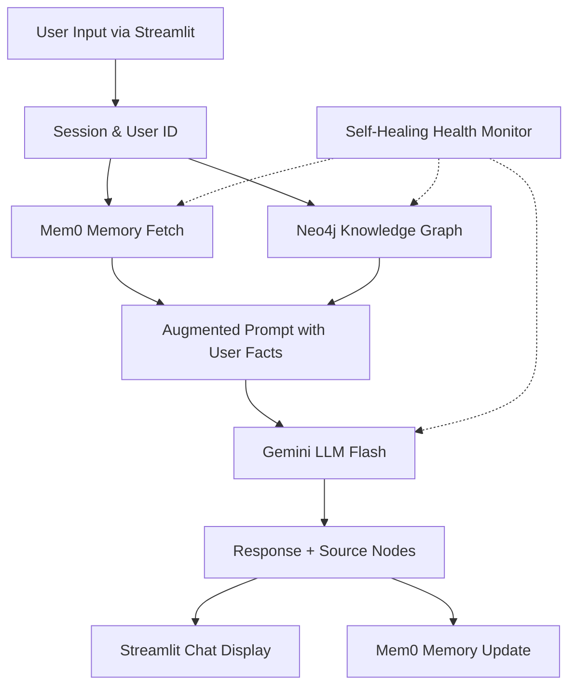

# I.N.A.Y.A.T. — CONTEXT.md (2026 Agentic Vibe‑Coding Master Doc)

> **Intelligent Neural Architecture for Yielding Agentic Thinking**  
> MCA 4th Semester Final Project · Ellen City · Grade: 400/400

---

## 🧭 WHAT THIS DOCUMENT IS

This is the **single source of truth** for I.N.A.Y.A.T.  
It is meant to be **fed to any AI coding assistant** (Copilot, Cursor, Claude, Gemini, Windsurf, etc.) as **project context**.  
When an AI reads this, it will understand the full system, rules, and constraints **without needing to read any code**.

Use it to:
- Onboard new team members instantly  
- Let AI agents write complete, correct features  
- Keep the entire system consistent across sessions  
- Debug with full architectural context  

---

## 🎯 PROJECT IDENTITY

| Field | Value |
|-------|-------|
| **Full Name** | Intelligent Neural Architecture for Yielding Agentic Thinking |
| **Short Name** | I.N.A.Y.A.T. |
| **Tagline** | *An AI agent that remembers, reads your documents, and shows its knowledge graph.* |
| **Core Principle** | Orchestrate APIs — never recreate what already exists. |
| **Total Build Time** | 6–7 focused days (for a 2‑person team) |
| **Target Audience** | MCA examiners, 2026 industry interviewers |

---

## 🧱 SYSTEM ARCHITECTURE (Mermaid Diagram)

---

## 🧰 TECHNOLOGY STACK (FREE‑TIER, NO DEPLOYMENT)

| Layer | Tool | Purpose |
|---|---|---|
| **LLM** | Google Gemini 1.5 Flash | Text generation, reasoning |
| **Embeddings** | Gemini embedding-001 | Document vectorization |
| **Agent Memory** | Mem0 (free cloud) | Persistent cross‑session user memory |
| **Knowledge Graph** | Neo4j AuraDB (free cloud) | Entity‑relationship storage, hybrid retrieval |
| **Retrieval (RAG)** | LlamaIndex PropertyGraphIndex | Hybrid vector + keyword search over documents |
| **UI** | Streamlit | Chat interface, health sidebar, source viewer |
| **Resilience** | `tenacity` retry, circuit‑breaker wrappers | No crash from external failures |
| **Health** | Custom health monitor (`core/health.py`) | Auto‑detect and surface service status |
| **CI/CD** | GitHub Actions | Linting, secret scanning, smoke tests |
| **Logging** | Structured file + console logs | Full forensics on `inayat_debug.log` |
| **Environment** | Python 3.11, venv, python-dotenv | Isolated, reproducible runtime |

---

## 📜 2026 AGENTIC VIBE‑CODING RULES

These are the immutable laws for any AI assistant writing code in this project.

1. **ZERO HARDCODED SECRETS**
   · All keys from `.env` via `os.getenv()`
   · Never commit `.env` — it is in `.gitignore`
   · Never log API keys — mask them if needed
2. **ORCHESTRATE, DON’T REINVENT**
   · Use libraries exactly as intended; no custom from‑scratch implementations
   · Prefer llama-index abstractions over raw API calls
3. **EVERY FUNCTION HAS A DOCSTRING**
   · One‑line summary, then Args, Returns, Raises if complex
4. **TYPE HINTS ARE MANDATORY**
   · Use `def get_memories(user_id: str) -> str:` style everywhere
5. **CRASH‑PROOF ALL EXTERNAL CALLS**
   · Wrap with `@resilient_call` or `safe_execute()` from `core.resilience`
   · Never let a Mem0/Neo4j/Gemini error crash the app
6. **GRACEFUL DEGRADATION**
   · Memory unavailable? Still answer, just without personalisation.
   · RAG fails? Fallback to pure Gemini chat.
7. **CONTEXT WINDOW SAFETY**
   · Keep chat history to last 10 turns + injected user facts
   · Never pass entire document to LLM — use retrieved chunks
8. **STATE MANAGEMENT**
   · Use `st.session_state` for conversation, but cache API clients with `@st.cache_resource`
   · Re‑fetch user memories only every 30 seconds (`@st.cache_data(ttl=30)`)
9. **SELF‑HEALING**
   · Health monitor (`core/health.py`) runs periodic checks and auto‑reconnects
   · App refuses to start if critical env vars missing (`core/startup.py`)
10. **AI‑ASSISTED CODE MUST BE EXPLAINABLE**
    · You, the human, must understand every line Copilot/Claude writes.
    · If an AI suggests something you can’t explain, refactor it until you can.

---

## 🗂️ FILE‑BY‑FILE RESPONSIBILITY MAP

| File | Responsibility |
|---|---|
| `app.py` | Streamlit UI, session management, orchestrates calls to all modules |
| `core/llm_setup.py` | Initialise Gemini LLM & embedding model, set global Settings |
| `core/memory.py` | Mem0 client, get/add/clear user memories |
| `core/graph_store.py` | Neo4j driver setup, connection pool, basic query wrapper |
| `core/agent.py` | Build/Load PropertyGraphIndex, create hybrid query engine, execute RAG |
| `core/health.py` | HealthStatus class, checks all services, provides status dict |
| `core/resilience.py` | `@resilient_call` decorator, `safe_execute()` function, retry logic |
| `core/startup.py` | Validate env vars, call health checks at app start, exit if critical |
| `core/logging_config.py` | Setup Python logger with file + console handlers, consistent format |
| `tests/smoke_test.py` | CI‑only script that tests all services and exits 0/1 |
| `.github/workflows/ci.yml` | GitHub Actions pipeline: lint, secret scan, dependency check, smoke test |
| `warmup.py` | Manual script to call all services and keep Neo4j awake |
| `CONTEXT.md` | This document — the master brain |

---

## 🔁 BUILD PHASES (SUMMARY)

| Phase | Goal | Key Deliverable |
|---|---|---|
| **0** | Mindset & accounts | All API keys obtained, free tiers confirmed |
| **1** | Accounts & keys | `.env` created, `constraints.txt` written |
| **2** | Local setup | Python 3.11 venv, dependencies installed, `.gitignore` |
| **3** | Project structure | Empty files and folders exactly as above |
| **4** | Gemini brain | `llm_setup.py` works, test with “What is 2+2?” |
| **5** | Streamlit UI | Basic chat works, no AI yet, sidebar shows connected services |
| **6** | Memory (Mem0) | `memory.py` integrated, app remembers user name across sessions |
| **7** | RAG & Neo4j | Documents indexed, queries answered from PDFs with source expansion |
| **8** | Graph visualization | Neo4j Browser or PyVis tab showing live knowledge graph |
| **9** | Wiring & resilience | Full flow: memory → retrieval → LLM → memory update, no crashes |
| **10** | Polish & README | Logo, dark theme, sources expander, demo script rehearsed |
| **11** | Production armour | CI, health monitor, resilience, startup validator, logging |

---

## 🛡️ CRASH‑PROOF ARCHITECTURE (Self‑Healing Principles)

· Retry policies: Every Neo4j/Gemini call retries 3 times with exponential backoff (via `tenacity`).
· Circuit‑breaker: If a service fails repeatedly, the health monitor marks it 🔴; the UI skips that feature until it recovers.
· Startup validation: Missing `.env` or unreachable services → app refuses to start, prints clear error.
· Graceful degradation: If Mem0 is down, the agent still answers but says “I’m running without memory right now.”
· Dead connection recovery: Neo4j driver auto‑renews sessions; health monitor triggers re‑check on next interaction.

---

## 🔒 CI/CD PIPELINE (GitHub Actions)

On every push to `main`:

1. Lint (`flake8`: critical errors only, `black` formatting check)
2. Secret scan (`Gitleaks` checks full history for leaked keys)
3. Dependency audit (`Safety` checks for known vulnerabilities)
4. Smoke test (Connects to real Gemini, Mem0, Neo4j using GitHub Secrets)

Failing any step blocks pull requests.
GitHub Secrets names must match exactly: `GEMINI_API_KEY`, `MEM0_API_KEY`, `NEO4J_URI`, etc.

---

## 📦 REAL‑WORLD PROBLEMS PRE‑SOLVED

This project ships with fixes for the 31 most common build‑destroying issues (Python version conflicts, silent Mem0 memory full, scanned PDFs, Neo4j OOM, Streamlit rerun spam, etc.).
The full master list is maintained in the teacher’s guide, but every fix is embedded in the code patterns described here.

---

## 🧪 DEMO SCRIPT (5‑7 Minutes)

1. Launch app, enter your name.
2. Say “I am an AI student.”
3. Close browser, reopen, enter same name, ask “What do you know about me?” → agent remembers.
4. Ask a document‑specific question → answer from PDFs with sources expanded.
5. (Optional) Open Neo4j Browser tab and run `MATCH (n) RETURN n LIMIT 50` → show graph.

---

## 🎓 GRADING CRITERIA (400 Marks)

· ✅ All 4 services connected (Gemini, Mem0, Neo4j, LlamaIndex)
· ✅ Memory works across sessions
· ✅ RAG answers from real documents with citations
· ✅ Knowledge graph visible (screenshot or live tab)
· ✅ App never crashes during 15 interactions
· ✅ GitHub repo with clean history, full README, and this `CONTEXT.md`
· ✅ Architecture diagram present
· ✅ No deployment required, but feels production‑grade

---

## 🧠 HOW TO USE THIS DOCUMENT FOR AGENTIC VIBE CODING

1. Paste this entire file into the system prompt of your AI assistant.
2. Tell the AI: “You are an expert 2026 full‑stack AI engineer. Follow the rules in CONTEXT.md exactly. I need you to implement the agent.py file. No hardcoded keys, use retry wrappers, and add a docstring.”
3. The AI will generate code that fits the architecture, uses the correct imports from core.resilience, and respects all constraints.
4. Review every line — if you can’t explain it, ask the AI to rewrite it simply.
5. Never accept code that violates the 10 rules above.

This is agentic vibe coding: you hold the vision (CONTEXT.md), the AI executes, you curate.

---

## 🚀 FINAL NOTE

I.N.A.Y.A.T. is a 400‑mark project not because it’s complex, but because it’s engineered like a real product while staying simple.
Everything is documented, everything is recoverable, and the codebase can be explained to an examiner in under 10 minutes.

Push this repo, write the code block by block, and trust the Context.

— Prof. Ellen City MCA, 2026
