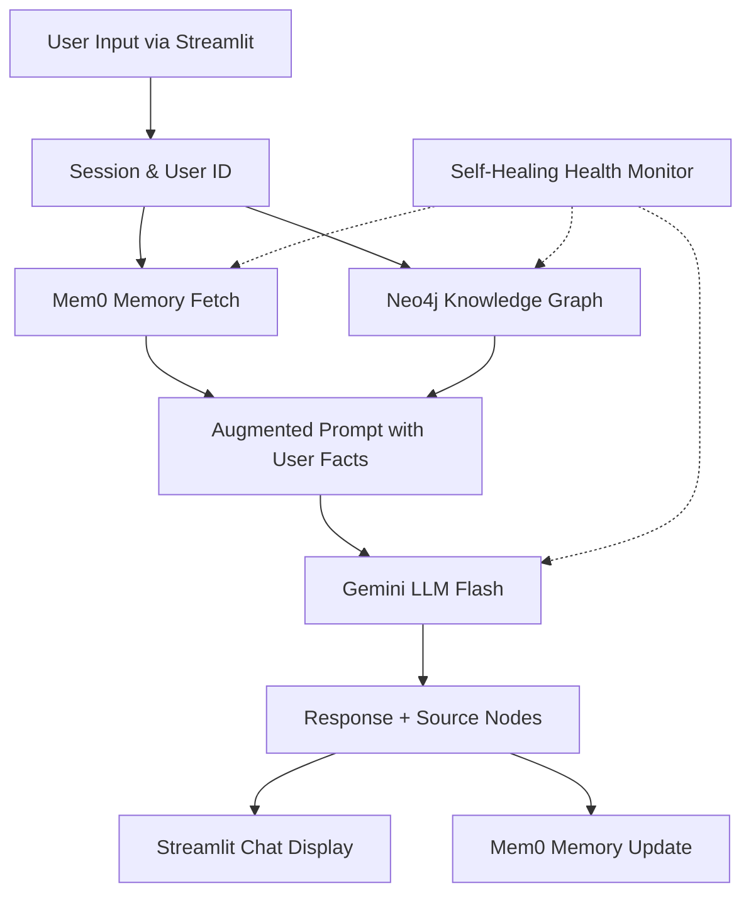

# I.N.A.Y.A.T.

> **Intelligent Neural Architecture for Yielding Agentic Thinking**  
> An AI agent that remembers, reads your documents, and visualizes its knowledge graph.

This repository is structured as a living, AI‑ready, agentic vibe‑coding scaffold.

## 🧭 Project Architecture



For the complete implementation philosophy, technology stack details, rules, file responsibilities, build phases, and self-healing resilience guidelines, see the single source of truth document:
👉 **[CONTEXT.md](CONTEXT.md)**

## 📂 Folder Structure

```
INAYAT/
│
├── CONTEXT.md                     ← THE BRAIN (System design, rules, stack)
├── README.md                      ← This document
├── .gitignore
├── .env.example                   ← Template environment variables
├── constraints.txt                ← Pinned dependency versions
├── requirements.txt               ← Pip dependencies
│
├── .github/
│   └── workflows/
│       └── ci.yml                 ← CI pipeline (lint, secret scan, smoke test)
│
├── core/
│   ├── __init__.py
│   ├── llm_setup.py               ← Gemini & embeddings configuration
│   ├── memory.py                  ← Mem0 memory integration
│   ├── graph_store.py             ← Neo4j AuraDB driver & index
│   ├── agent.py                   ← LlamaIndex query engine + RAG
│   ├── health.py                  ← Self‑healing health monitor
│   ├── resilience.py              ← Retry, circuit breaker, safe_execute
│   ├── startup.py                 ← Env validation & service warm‑up
│   └── logging_config.py          ← Structured logging configuration
│
├── data/
│   └── documents/                 ← Text-based PDFs for RAG indexing
│
├── tests/
│   └── smoke_test.py              ← Automated service connectivity test
│
├── assets/
│   └── logo.png
│
├── app.py                         ← Main Streamlit entry point
└── warmup.py                      ← Manual service pre-warm script
```

## 🛠️ Quick Start

1. **Clone and setup virtual environment**:
   ```bash
   python -m venv venv
   source venv/bin/activate  # On Windows: venv\Scripts\activate
   pip install -r requirements.txt
   ```

2. **Configure environment**:
   ```bash
   cp .env.example .env
   # Edit .env with your actual API keys and credentials
   ```

3. **Run warmup and start app**:
   ```bash
   python warmup.py
   streamlit run app.py
   ```
