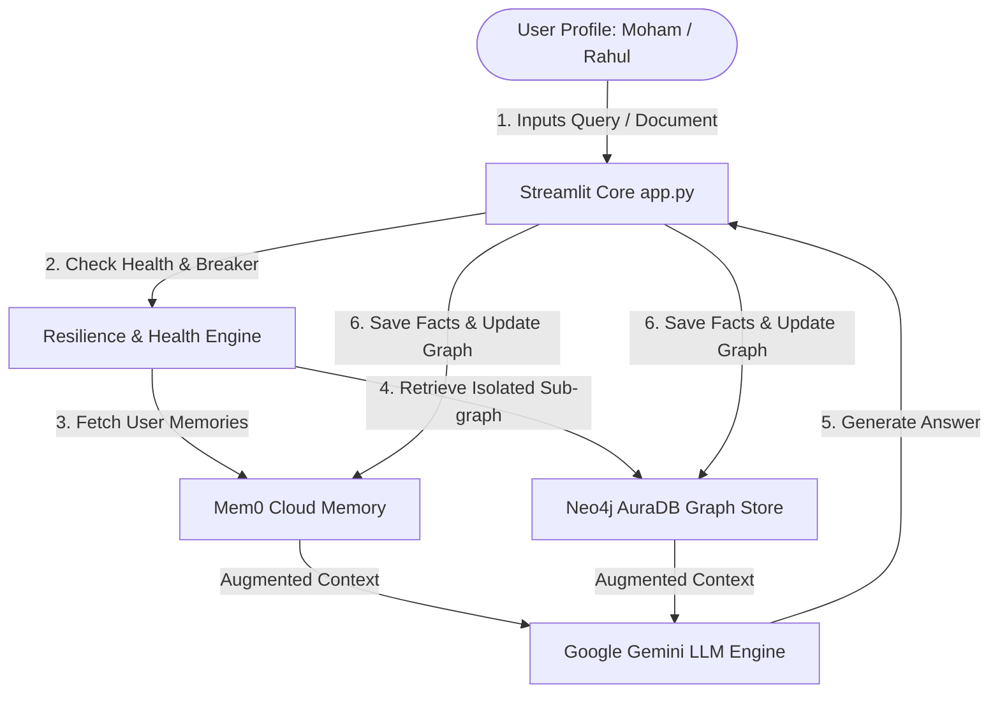
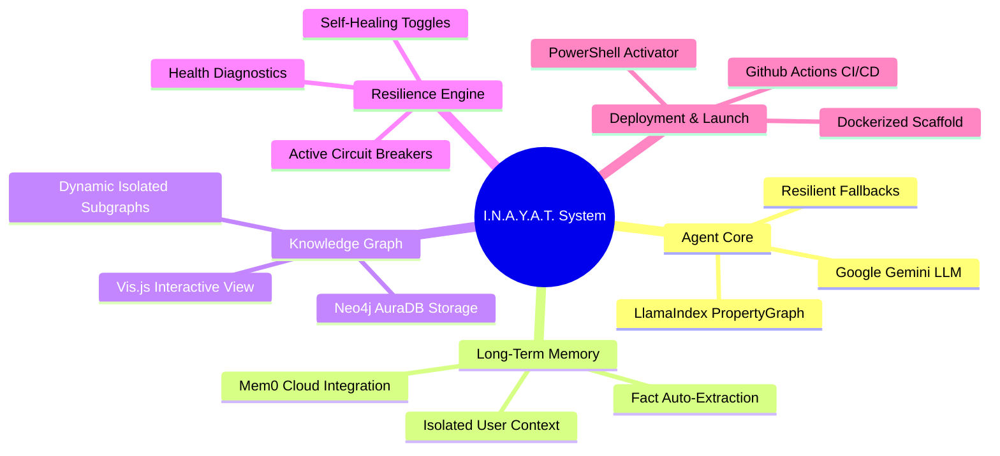

<h1 align="center">🧠 I.N.A.Y.A.T.</h1>
<p align="center">
  <strong>Intelligent Neural Architecture for Yielding Agentic Thinking</strong><br>
  <em>A State-of-the-Art Agentic RAG System with Isolated Multi-User Memory, Hybrid Knowledge Graphs, and Self-Healing Resilience.</em>
</p>

<p align="center">
  
  
  
  
  
  <br>
  
  
  
  
</p>

---

## 📋 Table of Contents

1. [🧠 Overview](#-overview)
2. [🔁 System Architecture](#-system-architecture)
3. [🧩 Capabilities Mind Map](#-capabilities-mind-map)
4. [⚙️ Tech Stack](#️-tech-stack)
5. [📂 Project Structure](#-project-structure)
6. [✨ Key Features](#-key-features)
7. [🎬 Live Demo Script](#-live-demo-script)
8. [🛠️ Installation & Launch](#️-installation--launch)
9. [🧪 Testing Suite](#-testing-suite)
10. [📄 Technical Documentation](#-technical-documentation)
11. [🎥 Video Presentation](#-video-presentation)
12. [🤝 Contributing](#-contributing)
13. [📜 License](#-license)

---

## 🧠 Overview

**I.N.A.Y.A.T.** (Intelligent Neural Architecture for Yielding Agentic Thinking) is an enterprise-grade agentic Retrieval-Augmented Generation (RAG) system. It combines Google Gemini LLMs with isolated long-term user memories and multi-user graph structures. Unlike traditional stateless RAG models, I.N.A.Y.A.T. operates with a persistent context engine that grows with the user. It is built to support production environments where multi-user isolation, high resilience, and interactive knowledge visualizations are mandatory.

The system addresses three critical limitations of current AI architectures:
1. **Context Loss:** By incorporating a persistent user-memory loop (via Mem0), it remembers facts, personal preferences, and details across sessions.
2. **Context Disconnect:** Instead of simple flat vector matching, it indexes documents into entity-relation networks using LlamaIndex PropertyGraphIndex over a live Neo4j AuraDB instance. This enables path-based hybrid queries.
3. **API Fragility:** Integrated self-healing active circuit breakers protect critical API endpoints, allowing the system to degrade gracefully to direct LLM completion rather than throwing stack traces when databases or cloud memory APIs go offline.

---

## 🔁 System Architecture

The following diagram illustrates the 6-step agentic execution loop during a user query or document ingestion, demonstrating multi-profile session integrity and isolation:



---

## 🧩 Capabilities Mind Map

A structural overview of the system's component relationships, service integrations, and runtime controls:



---

## ⚙️ Tech Stack

| Component | Technology | Version | Purpose |
| :--- | :--- | :--- | :--- |
| **User Interface** | [Streamlit](https://streamlit.io/) | `^1.43.0` | Sleek, glassmorphic UI dashboard |
| **Graph Store** | [Neo4j AuraDB](https://neo4j.com/) | `^5.0` | Cloud Property Graph Database |
| **Memory Engine** | [Mem0](https://mem0.ai/) | `^0.1.0` | Persistent personalized memory API |
| **Language Model** | [Gemini 1.5 Flash](https://deepmind.google/technologies/gemini/) | `gemini-1.5-flash` | Reasoning and text completion |
| **Framework** | [LlamaIndex](https://www.llamaindex.ai/) | `^0.12.0` | RAG indexing and database adapters |
| **Visualization** | [Vis.js](https://visjs.org/) | `standalone` | Interactive client-side network graph |

---

## 📂 Project Structure

```
INAYAT/
├── assets/
│   └── logo.png                  # Project Brand Asset
├── core/
│   ├── agent.py                  # LlamaIndex RAG, Property Graph indexing & isolation
│   ├── graph_store.py            # Neo4j connections, user sub-graphs & Vis.js formatting
│   ├── health.py                 # Automated API & database diagnostics probes
│   ├── llm_setup.py              # Gemini LLM and embeddings wrappers
│   ├── logging_config.py         # Thread-safe, standardized structured logs
│   ├── memory.py                 # Mem0 memory client & circuit breaker
│   ├── resilience.py             # Active circuit breakers & safe execution blocks
│   └── startup.py                # Environment checking and bootstrapping
├── data/
│   └── documents/                # Isolated document directories (per-user indexing)
├── tests/
│   ├── smoke_test.py             # Basic service connectivity & imports check (19 tests)
│   └── backend_feature_test.py   # Full system integration & isolation validation (10 tests)
├── .github/workflows/
│   └── ci.yml                    # Automated GitHub Action workflow (Lint & Smoke Test)
├── app.py                        # Unified Streamlit Workspace
├── Dockerfile                    # Docker build configuration
├── docker-compose.yml            # Multi-container local deployment
├── activate.ps1                  # One-click Windows setup/launch script
├── warmup.py                     # Standalone diagnostics validator
├── CONTEXT.md                    # Core architecture design references
├── MASTER_DEEP_DIVE_REPORT.txt   # Analysis and audit report
└── README.md                     # This documentation
```

---

## ✨ Key Features

- **👤 Isolated User Sessions:** Switching profile names in the sidebar immediately loads the user's isolated chat history and files.
- **📂 Isolated Document Ingestion:** Documents are split into isolated directories (`data/documents/{user_id}/`). Rebuilding the index caches property graphs per-user.
- **🧠 Persistent Memory via Mem0:** User details, constraints, and instructions are extracted and stored across visits, allowing personal context queries.
- **🕸️ Graph RAG (Neo4j):** Converts raw documents into entity-relation properties, queried via path-based graph retrieval.
- **📈 Interactive Vis.js Visualizer:** Displays live Neo4j graphs in a side-by-side layout, including a detailed interactive node drawer and direct "Use in Chat 💬" synchronization.
- **🛡️ Active Circuit Breakers:** Graceful fallbacks automatically route requests to direct LLMs if Neo4j or Mem0 APIs undergo forced or real failures.
- **⚡ One-Click PowerShell Activator:** Installs `.venv`, resolves package wheels, runs warmup probes, and launches the app on Port `8501`.
- **🐳 Container Support:** Full Dockerfile and docker-compose configurations ready for local/cloud deployment.

---

## 🎬 Live Demo Script

<details>
<summary>🔍 Click to expand the Examiner's Live Demo Step-by-Step Script</summary>

### 1. Welcome & Service Health Check
- Open the application and inspect the **🛡️ Service Health** panel in the sidebar.
- Show that all connections are `🟢 Connected` (Gemini, Mem0, Neo4j).

### 2. Enter Profile & Add Memory
- Set the user profile to **Rahul**.
- Send a message: `"I am a machine learning student. I love NLP and knowledge graphs."`
- Show the Mem0 persistent memory panel updating with the new facts.

### 3. Session Isolation & Reset
- Switch the user profile to **Moham**. Notice that the chat history and graph immediately switch to Moham's workspace (or fallback mocks if Moham is new).
- Switch back to **Rahul** or refresh the browser. Notice the URL maintains `?user=Rahul` and Rahul's chat history/memory returns instantly.
- Ask: `"What do you know about me?"` to verify Rahul's facts are retrieved.

### 4. Graph Ingestion & Sync
- Ingest a sample text or PDF document. Wait for the confirmation "Graph Index updated!".
- View the **Neural Architecture Graph** tab. Click on any node representing a document chunk.
- Inspect the node attributes in the drawer and click **Use in Chat 💬** to sync the node query immediately into the chat input.

### 5. Resilience Failover Test
- Turn on **🔥 Force Fail Mem0** in the sidebar.
- Verify Mem0 health status changes to `🔴 Forced Fail`.
- Ask a question in chat. The application degrades gracefully, responding via Gemini/Neo4j, without crashes or unhandled stack traces.

</details>

---

## 🛠️ Installation & Launch

### Option A: Native Windows (Recommended)
Clone the repository and run the PowerShell activator from the root folder:
```powershell
powershell -ExecutionPolicy Bypass -File activate.ps1
```
This script will:
1. Initialize the Python virtual environment.
2. Install dependencies.
3. Verify environment credentials.
4. Launch the Streamlit application at `http://localhost:8501`.

### Option B: Docker
Ensure Docker is installed and running, then start the containers:
```bash
docker-compose up --build
```
The app will bind to port `8501`.

---

## 🧪 Testing Suite

The repository has two automated test suites covering imports, environment structures, circuit breakers, and core functions:

```bash
# Run basic smoke connectivity & module import tests
.venv\Scripts\python -m unittest tests/smoke_test.py

# Run comprehensive integration and isolation tests
.venv\Scripts\python -m unittest tests/backend_feature_test.py
```
*Both suites must pass with `OK` before submitting a pull request.*

---

## 📄 Technical Documentation

For details on the project design and examiners briefs, refer to the following committed files:
- [CONTEXT.md](CONTEXT.md) — Architectural principles, rules, and folder structure.
- [MASTER_DEEP_DIVE_REPORT.txt](MASTER_DEEP_DIVE_REPORT.txt) — Comprehensive codebase review and resilience logs.
- [inayat_project_deep_dive.pdf](inayat_project_deep_dive.pdf) — Academic and presentation-ready architecture report.
- [inayat_technical_architecture.pdf](inayat_technical_architecture.pdf) — Tech-stack specification schema.

---

## 🎥 Video Presentation

*Placeholder: Link your project walk-through video here.*
[](https://youtube.com)

---

## 🤝 Contributing

Contributions are welcome! Please follow these guidelines:
1. Open an issue describing the bug or feature request.
2. Verify all local tests pass before proposing code modifications.
3. Open a Pull Request targeting the `master` branch.

---

## 📜 License

This project is licensed under the MIT License. See [LICENSE](LICENSE) (if present) or refer to standard MIT terms.
