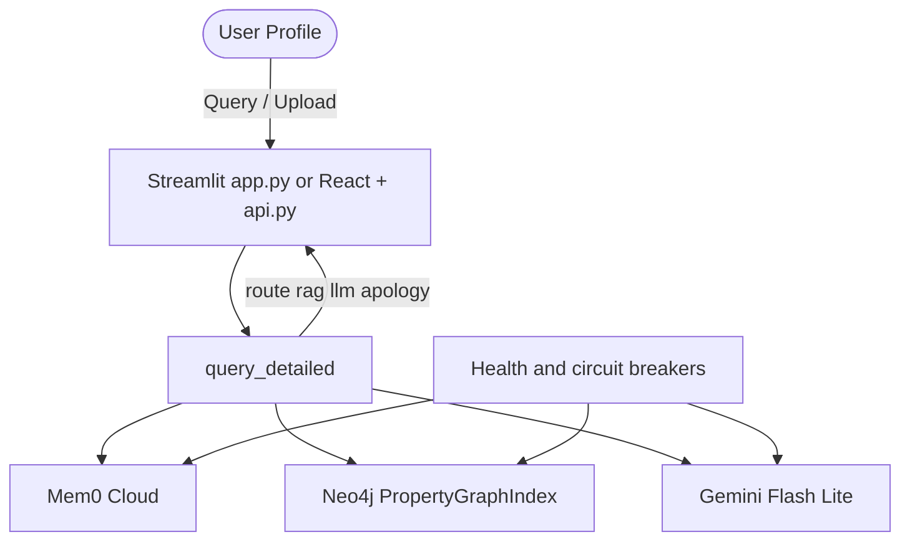

<h1 align="center">🧠 I.N.A.Y.A.T.</h1>
<p align="center">
  <strong>Intelligent Neural Architecture for Yielding Agentic Thinking</strong><br>
  <em>Single-agent RAG with isolated user memory, property-graph retrieval, and self-healing resilience.</em>
</p>

<p align="center">
  
  
  
  
  
  <br>
  
  
  
  
</p>

---

## Canonical status (source of truth)

| Fact                | Value                                                                                    |
| ------------------- | ---------------------------------------------------------------------------------------- |
| **Maturity**        | Advanced MVP / demo-ready; not hardened production                                       |
| **Agent model**     | Single-agent RAG pipeline (not LangGraph/CrewAI multi-agent)                             |
| **Python**          | 3.12                                                                                     |
| **LLM**             | `gemini-flash-lite-latest`                                                               |
| **Embeddings**      | `gemini-embedding-001` (3072-dim)                                                        |
| **Chunking**        | size 512, overlap 64 (env: `INAYAT_CHUNK_SIZE`, `INAYAT_CHUNK_OVERLAP`)                  |
| **Retrieval**       | PropertyGraphIndex, `similarity_top_k=5`, `user_id` metadata filter                      |
| **Tests**           | 52 smoke (`tests/smoke_test.py`) + 10 live (`tests/backend_feature_test.py`)             |
| **CI**              | flake8 (E9,F63,F7,F82) + black + gitleaks + pip-audit + smoke + frontend build           |
| **Docker**          | Default SPA `:8000` (`Dockerfile.spa`); Streamlit `--profile streamlit` `:8501`          |
| **Seed docs**       | `data/documents/_samples/` (MIT); copy into `data/documents/{your_name}/`                |
| **UIs**             | Streamlit (`app.py`) and FastAPI+React (`api.py`, `frontend/`)                           |
| **Isolation**       | Soft: folder + metadata + Mem0 `user_id`; **shared Neo4j DB**; optional `INAYAT_API_KEY` |
| **Critical env**    | `GEMINI_API_KEY`                                                                         |
| **Recommended env** | `MEM0_API_KEY`, `NEO4J_URI`, `NEO4J_USERNAME`, `NEO4J_PASSWORD`                          |

**Examiner one-liner:** I.N.A.Y.A.T. is a single-agent, production-pattern RAG system (Gemini + LlamaIndex PropertyGraphIndex + Neo4j + Mem0) with documented dual UIs, typed config, validated user ids, CI that matches Docker (Python 3.12), and honest test counts (52 smoke on every PR, 10 live on schedule). Isolation is soft multi-tenancy on a shared graph — acceptable for a demo, not a multi-tenant SaaS.

See also: [STATUS.md](STATUS.md) (one-page examiner sheet).

---

## 📋 Table of Contents

1. [Overview](#-overview)
2. [What this repo now includes](#-what-this-repo-now-includes)
3. [System Architecture](#-system-architecture)
4. [Tech Stack](#️-tech-stack)
5. [Project Structure](#-project-structure)
6. [Key Features](#-key-features)
7. [Installation & Launch](#️-installation--launch)
8. [Environment](#-environment)
9. [Testing Suite](#-testing-suite)
10. [CI Pipeline](#-ci-pipeline)
11. [Documentation](#-documentation)
12. [Non-goals](#-non-goals)
13. [License](#-license)

---

## 🧠 Overview

**I.N.A.Y.A.T.** combines Google Gemini, Mem0 long-term memory, and LlamaIndex `PropertyGraphIndex` over Neo4j AuraDB. It is a **single-agent** RAG system with graceful degradation (RAG → LLM → apology) and per-user document folders.

Upload PDFs or TXT files per profile. Sample documents ship under `data/documents/_samples/` — copy them into `data/documents/{your_name}/` then rebuild the index (see `_samples/README.md`).

The 2026-08-13 remediation (`HOW_TO_FIX.md` §1–§13) is **complete**: docs match the code, CI matches Docker (Python 3.12), user ids are validated, query routing is explicit JSON, graph vis is user-filtered, and observability logs structured query events without prompts or API keys.

---

## ✨ What this repo now includes

Shipped on branch `cursor/what-and-how-to-fix-docs` (see [STATUS.md](STATUS.md) for the step checklist):

| Area               | What changed                                                                                                                            |
| ------------------ | --------------------------------------------------------------------------------------------------------------------------------------- |
| **Docs**           | Canonical README / STATUS / CONTEXT / LICENSE; `WHAT_TO_FIX.md` is historical inventory; examiner one-liner uses **52 smoke / 10 live** |
| **Seed RAG**       | MIT sample PDFs in `data/documents/_samples/` (CEO fact: Dr. Inayat Hussain)                                                            |
| **Config**         | `core/settings.py` (`InayatSettings`); chunk/model from env; overlap must be &lt; chunk size                                            |
| **Identity**       | `core/identity.py` — `UserId.parse()` rejects `../` and `/`                                                                             |
| **Query contract** | `QueryResult` with `route`, `used_memory`, `source_count`; wrapper `query()` still returns `str`                                        |
| **Memory**         | `build_memory_context()` search + get_all, 2000-char cap, fallback if Mem0 is down                                                      |
| **RAG gate**       | Disclaimer/hedge does **not** force LLM fallback when sources exist                                                                     |
| **Ingest**         | PDF `%PDF` check; `INAYAT_SYNC_INGEST=true` default; `INAYAT_ALLOW_EMPTY_FROM_EXISTING=false`                                           |
| **Graph**          | Visualization Cypher filtered to the current user; `is_mock` when no chunks                                                             |
| **API**            | FastAPI lifespan, CORS from settings, optional `INAYAT_API_KEY` + `X-INAYAT-KEY`, `X-Request-ID`                                        |
| **Demo safety**    | Breaker `forced_open` requires `INAYAT_DEMO_MODE=true` (403 otherwise)                                                                  |
| **Docker**         | Default compose = SPA `:8000` (`Dockerfile.spa`); Streamlit `--profile streamlit` `:8501`                                               |
| **Flags**          | MMR off by default; async ingest off by default (sync wait-for-200)                                                                     |
| **Observability**  | `core/observability.py` — `event=query user_id=... route=... latency_ms=... source_count=... mem0_ok=... neo4j_ok=...`                  |
| **SPA**            | Badges from API `route` / `used_memory` (not inferred from answer text); mock-graph banner; 403 copy for demo mode                      |
| **Tests**          | 52 smoke (no keys required for new identity/settings/route tests) + `tests/test_api_contract.py` + live CEO skipUnless                  |

---

## 🔁 System Architecture


```mermaid
flowchart TD
    User([User Profile]) -->|Query / Upload| UI[Streamlit app.py or React + api.py]
    UI --> Agent[query_detailed]
    Agent --> Mem0[Mem0 Cloud]
    Agent --> Neo4j[Neo4j PropertyGraphIndex]
    Agent --> LLM[Gemini Flash Lite]
    Agent -->|route rag llm apology| UI
    Health[Health and circuit breakers] --> Mem0
    Health --> Neo4j
    Health --> LLM
```

Degradation order: **RAG** (sources present) → **LLM** (no sources / RAG failed) → **apology** (LLM also failed). Circuit breakers isolate Mem0 and Neo4j failures so the process stays up.

---

## ⚙️ Tech Stack

Pinned versions are in [constraints.txt](constraints.txt).

| Component         | Technology             | Pinned version             | Purpose                   |
| :---------------- | :--------------------- | :------------------------- | :------------------------ |
| **UI (legacy)**   | Streamlit              | `1.58.0`                   | Demo dashboard (`app.py`) |
| **UI (modern)**   | React + Vite + FastAPI | see `frontend/`            | SPA + REST API            |
| **Graph store**   | Neo4j AuraDB           | driver `5.28.4`            | Property graph storage    |
| **Memory**        | Mem0                   | `mem0ai==2.0.4`            | Persistent user memory    |
| **LLM**           | Gemini Flash Lite      | `gemini-flash-lite-latest` | Generation                |
| **Embeddings**    | Gemini                 | `gemini-embedding-001`     | 3072-dim vectors          |
| **RAG**           | LlamaIndex             | core `0.14.22`             | PropertyGraphIndex        |
| **Visualization** | Vis.js                 | in frontend                | Graph drawer              |
| **Config**        | pydantic-settings      | `2.12.0`                   | Typed env settings        |

---

## 📂 Project Structure

```
INAYAT/
├── app.py                        # Streamlit UI (--profile streamlit)
├── api.py                        # FastAPI REST + SPA static host (:8000)
├── run_spa.py                    # Dev: uvicorn + Vite
├── warmup.py                     # Neo4j RETURN 1; optional default index
├── activate.ps1                  # Windows launcher (sets INAYAT_DEMO_MODE)
├── requirements.txt
├── constraints.txt               # Pinned dependency versions
├── .env.example
├── LICENSE                       # MIT
├── STATUS.md                     # One-page examiner status
├── CONTEXT.md                    # Contributor module map
├── WHAT_TO_FIX.md                # Historical issue inventory
├── HOW_TO_FIX.md                 # Remediation spec (implemented)
├── core/
│   ├── settings.py               # Typed env (InayatSettings)
│   ├── identity.py               # UserId.parse()
│   ├── observability.py          # request_id + event=query logs
│   ├── schemas.py                # QueryInput / QueryResult
│   ├── conversation.py           # Short-term chat buffer
│   ├── ingest.py                 # Uploads + index lifecycle
│   ├── agent.py                  # query_detailed() + query() → str
│   ├── llm_setup.py              # Gemini LLM + embeddings
│   ├── memory.py                 # Mem0 + build_memory_context()
│   ├── graph_store.py            # Neo4j + user-filtered vis JSON
│   ├── resilience.py             # Circuit breakers + demo gate
│   ├── health.py                 # HealthMonitor
│   ├── startup.py                # Boot validation
│   ├── compat.py                 # Backwards-compat exports
│   └── logging_config.py         # Rotating file + console
├── frontend/                     # React SPA (Vite)
├── data/documents/_samples/      # MIT sample PDFs
├── tests/
│   ├── smoke_test.py             # 52 tests (CI)
│   ├── test_api_contract.py      # FastAPI TestClient (loaded by smoke)
│   └── backend_feature_test.py   # 10 live integration tests
├── .github/workflows/
│   ├── ci.yml                    # Python 3.12 + smoke + frontend-build
│   └── integration.yml           # Weekly / manual live tests
├── Dockerfile                    # Streamlit :8501
├── Dockerfile.spa                # Multi-stage Vite + uvicorn :8000
└── docker-compose.yml            # Default SPA; --profile streamlit
```

---

## ✨ Key Features

- **Isolated user sessions** — `data/documents/{user_id}/` + Mem0 `user_id` + metadata filters on a **shared Neo4j database** (not per-user Aura instances). Isolation is demo-grade metadata, not multi-tenant SaaS.
- **Validated user ids** — `UserId.parse()`; invalid names (`../etc`, `alice/bob`) fail at the API with 400.
- **Property-graph RAG** — LlamaIndex `PropertyGraphIndex` over Neo4j. There is **no separate BM25 index**.
- **Explicit routes** — SPA badges use `route` (`rag` / `llm` / `apology`) and `used_memory` from `/api/query`, not answer-text heuristics.
- **MMR retrieval** — off by default (`INAYAT_MMR_ENABLED=false`); falls back to `similarity_top_k` if LlamaIndex rejects MMR kwargs.
- **Chunking** — `INAYAT_CHUNK_SIZE` / `INAYAT_CHUNK_OVERLAP` (defaults 512/64). Rebuild the index after changing chunk settings.
- **Empty-folder isolation** — `INAYAT_ALLOW_EMPTY_FROM_EXISTING=false` by default (no shared-graph attach).
- **Ingest** — Streamlit stays sync. `POST /api/upload` waits for 200 when `INAYAT_SYNC_INGEST=true` (default).
- **Dual UI** — Streamlit for demos; FastAPI+React for the Docker default SPA.
- **Circuit breakers** — Mem0/Neo4j degradation without crashes. Toggles need `INAYAT_DEMO_MODE=true`.
- **Optional API key** — empty `INAYAT_API_KEY` keeps the open demo; if set, mutating `/api/*` routes require `X-INAYAT-KEY`.
- **Observability** — UUID `X-Request-ID` per HTTP request and Streamlit turn; structured query logs; no full prompts or keys.

---

## 🛠️ Installation & Launch

Copy `.env.example` → `.env` and set `GEMINI_API_KEY` (required).

### Option A: Native Windows (Streamlit demo)

```powershell
powershell -ExecutionPolicy Bypass -File activate.ps1
```

Sets `INAYAT_DEMO_MODE=true`, runs warmup, launches Streamlit at `http://localhost:8501`.

Copy samples into your profile folder first:

```powershell
Copy-Item -Recurse "data\documents\_samples\*" "data\documents\YourName\"
```

### Option B: Docker (default = SPA on :8000)

```bash
docker compose up --build
```

Serves FastAPI + built React at `http://localhost:8000`. Healthcheck: `GET /api/health`. Volume: `./data`.

Streamlit:

```bash
docker compose --profile streamlit up --build
```

Binds `8501`. Images: `Dockerfile.spa` (multi-stage `npm ci && npm run build`) and `Dockerfile` (Streamlit).

Optional `INAYAT_API_KEY` gates mutating `/api/*` routes via `X-INAYAT-KEY`.

### Option C: FastAPI + React dev

```bash
pip install -r requirements.txt -c constraints.txt
python run_spa.py
```

API on `:8000`, Vite on `:5173`.

---

## 🔐 Environment

| Variable                           | Required        | Notes                       |
| ---------------------------------- | --------------- | --------------------------- |
| `GEMINI_API_KEY`                   | **Yes**         | Generation + embeddings     |
| `MEM0_API_KEY`                     | Recommended     | Memory degrades if missing  |
| `NEO4J_URI` / `NEO4J_PASSWORD`     | Recommended     | Graph degrades if missing   |
| `NEO4J_USERNAME`                   | Default `neo4j` |                             |
| `INAYAT_DEMO_MODE`                 | Demo toggles    | `true` for breaker UI       |
| `INAYAT_API_KEY`                   | Optional        | If set, send `X-INAYAT-KEY` |
| `INAYAT_CORS_ORIGINS`              | Optional        | Explicit allow-list         |
| `INAYAT_MMR_ENABLED`               | Default `false` |                             |
| `INAYAT_SYNC_INGEST`               | Default `true`  | `false` → 202 + poll        |
| `INAYAT_ALLOW_EMPTY_FROM_EXISTING` | Default `false` | Safer empty folders         |

See `.env.example` for chunk size, top_k, log level, and memory context cap.

---

## 🧪 Testing Suite

```bash
# CI smoke suite (52 tests) — no live keys required for identity/settings/route tests
python tests/smoke_test.py

# Live integration (10 tests — requires real API keys)
python tests/backend_feature_test.py
```

Do **not** use pytest for CI; the supported runner is `python tests/smoke_test.py`. The smoke `__main__` also loads `tests/test_api_contract.py` (invalid `user_id` → 400, breaker toggle without demo → 403, CORS, `X-Request-ID`).

Live RAG CEO assertion is skipped unless documents exist under a profile folder; after copying `_samples/`, the CEO fact remains asserted.

---

## 🔄 CI Pipeline

On push/PR to `main` or `master` (see [.github/workflows/ci.yml](.github/workflows/ci.yml)):

1. **flake8** — critical errors only (`E9,F63,F7,F82`)
2. **black** — formatting check
3. **gitleaks** — secret scan
4. **pip-audit** — dependency vulnerability scan
5. **smoke tests** — `python tests/smoke_test.py` (52 tests)

**frontend-build** job (parallel): `npm ci` + `npm run build` in `frontend/`.

Does **not** run on every PR: `backend_feature_test.py` (live keys). See [.github/workflows/integration.yml](.github/workflows/integration.yml) — weekly schedule + manual dispatch. **Cost:** live Gemini + Mem0 + Neo4j per run.

Python **3.12**, installs with `pip install -r requirements.txt -c constraints.txt`.

---

## 📄 Documentation

| File                                                       | Role                                               |
| ---------------------------------------------------------- | -------------------------------------------------- |
| [README.md](README.md)                                     | This file — install, architecture, canonical facts |
| [STATUS.md](STATUS.md)                                     | One-page examiner sheet + completed §10 order      |
| [CONTEXT.md](CONTEXT.md)                                   | Contributor module map                             |
| [WHAT_TO_FIX.md](WHAT_TO_FIX.md)                           | Issue inventory (superseded for counts)            |
| [HOW_TO_FIX.md](HOW_TO_FIX.md)                             | Remediation spec (implemented §1–§13)              |
| [MASTER_DEEP_DIVE_REPORT.txt](MASTER_DEEP_DIVE_REPORT.txt) | Historical audit (superseded for counts)           |
| [demo_script.md](demo_script.md)                           | Live presentation script                           |

---

## 🚫 Non-goals

Not in this product: LangGraph/CrewAI multi-agent orchestration, per-user Neo4j Aura instances, replacing Mem0 or Neo4j, rewriting Streamlit into React in one commit, or calling optional `INAYAT_API_KEY` “production hardening.”

---

## 📜 License

MIT License — see [LICENSE](LICENSE).
