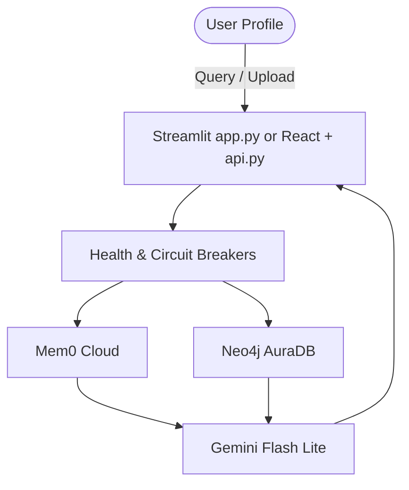

<h1 align="center">🧠 I.N.A.Y.A.T.</h1>
<p align="center">
  <strong>Intelligent Neural Architecture for Yielding Agentic Thinking</strong><br>
  <em>Single-agent RAG with isolated user memory, property-graph retrieval, and self-healing resilience.</em>
</p>

<p align="center">
  
  
  
  
  
  <br>
  
  
  
  
</p>

---

## Canonical status (source of truth)

| Fact                | Value                                                                        |
| ------------------- | ---------------------------------------------------------------------------- |
| **Maturity**        | Advanced MVP / demo-ready; not hardened production                           |
| **Agent model**     | Single-agent RAG pipeline (not LangGraph/CrewAI multi-agent)                 |
| **Python**          | 3.12                                                                         |
| **LLM**             | `gemini-flash-lite-latest`                                                   |
| **Embeddings**      | `gemini-embedding-001` (3072-dim)                                            |
| **Chunking**        | size 512, overlap 64 (env: `INAYAT_CHUNK_SIZE`, `INAYAT_CHUNK_OVERLAP`)      |
| **Retrieval**       | PropertyGraphIndex, `similarity_top_k=5`, `user_id` metadata filter          |
| **Tests**           | 44 smoke (`tests/smoke_test.py`) + 10 live (`tests/backend_feature_test.py`) |
| **CI**              | flake8 (E9,F63,F7,F82) + black + gitleaks + smoke tests only                 |
| **Docker**          | `python:3.12-slim`, Streamlit `:8501`; compose is **one** service            |
| **Seed docs**       | `data/documents/_samples/` (MIT); copy into `data/documents/{your_name}/`    |
| **UIs**             | Streamlit (`app.py`) and FastAPI+React (`api.py`, `frontend/`)               |
| **Isolation**       | Soft: folder + metadata + Mem0 `user_id`; shared Neo4j DB; no auth           |
| **Critical env**    | `GEMINI_API_KEY`                                                             |
| **Recommended env** | `MEM0_API_KEY`, `NEO4J_URI`, `NEO4J_USERNAME`, `NEO4J_PASSWORD`              |

See also: [STATUS.md](STATUS.md) (one-page examiner sheet).

---

## 📋 Table of Contents

1. [Overview](#-overview)
2. [System Architecture](#-system-architecture)
3. [Tech Stack](#️-tech-stack)
4. [Project Structure](#-project-structure)
5. [Key Features](#-key-features)
6. [Installation & Launch](#️-installation--launch)
7. [Testing Suite](#-testing-suite)
8. [CI Pipeline](#-ci-pipeline)
9. [Documentation](#-documentation)
10. [License](#-license)

---

## 🧠 Overview

**I.N.A.Y.A.T.** combines Google Gemini, Mem0 long-term memory, and LlamaIndex `PropertyGraphIndex` over Neo4j AuraDB. It is a **single-agent** RAG system with graceful degradation (RAG → LLM → apology) and per-user document folders.

Upload PDFs or TXT files per profile. Sample documents ship under `data/documents/_samples/` — copy them into `data/documents/{your_name}/` then rebuild the index (see `_samples/README.md`).

---

## 🔁 System Architecture


```mermaid
flowchart TD
    User([User Profile]) -->|Query / Upload| UI[Streamlit app.py or React + api.py]
    UI --> Health[Health & Circuit Breakers]
    Health --> Mem0[Mem0 Cloud]
    Health --> Neo4j[Neo4j AuraDB]
    Mem0 & Neo4j --> LLM[Gemini Flash Lite]
    LLM --> UI
```

---

## ⚙️ Tech Stack

Pinned versions are in [constraints.txt](constraints.txt).

| Component         | Technology             | Pinned version             | Purpose                   |
| :---------------- | :--------------------- | :------------------------- | :------------------------ |
| **UI (legacy)**   | Streamlit              | `1.58.0`                   | Demo dashboard (`app.py`) |
| **UI (modern)**   | React + Vite + FastAPI | see `frontend/`            | SPA + REST API            |
| **Graph store**   | Neo4j AuraDB           | driver `5.28.4`            | Property graph storage    |
| **Memory**        | Mem0                   | `mem0ai==2.0.4`            | Persistent user memory    |
| **LLM**           | Gemini Flash Lite      | `gemini-flash-lite-latest` | Generation                |
| **Embeddings**    | Gemini                 | `gemini-embedding-001`     | 3072-dim vectors          |
| **RAG**           | LlamaIndex             | core `0.14.22`             | PropertyGraphIndex        |
| **Visualization** | Vis.js                 | in frontend                | Graph drawer              |
| **Config**        | pydantic-settings      | `2.12.0`                   | Typed env settings        |

---

## 📂 Project Structure

```
INAYAT/
├── app.py                        # Streamlit UI (Docker default)
├── api.py                        # FastAPI REST + SPA static host
├── run_spa.py                    # Dev: uvicorn + Vite
├── warmup.py                     # Service warmup script
├── activate.ps1                  # Windows one-click launcher
├── requirements.txt
├── constraints.txt               # Pinned dependency versions
├── .env.example
├── LICENSE
├── STATUS.md                     # One-page examiner status
├── WHAT_TO_FIX.md
├── HOW_TO_FIX.md
├── core/
│   ├── settings.py               # Typed env configuration
│   ├── identity.py               # user_id validation
│   ├── observability.py          # Span logging
│   ├── schemas.py                # QueryInput / QueryResult
│   ├── conversation.py           # Short-term chat buffer
│   ├── ingest.py                 # Uploads + index lifecycle
│   ├── agent.py                  # RAG query engine
│   ├── llm_setup.py              # Gemini LLM + embeddings
│   ├── memory.py                 # Mem0 client
│   ├── graph_store.py            # Neo4j + vis payload
│   ├── resilience.py             # Circuit breakers + retries
│   ├── health.py                 # HealthMonitor
│   ├── startup.py                # Boot validation
│   ├── compat.py                 # Backwards-compat exports
│   └── logging_config.py
├── frontend/                     # React SPA (Vite)
├── data/
│   └── documents/
│       ├── .gitkeep              # Per-user uploads at runtime
│       └── _samples/             # MIT sample PDFs (copy to {your_name}/)
├── tests/
│   ├── smoke_test.py             # 44 tests (CI)
│   └── backend_feature_test.py   # 10 live integration tests
├── .github/workflows/ci.yml
├── Dockerfile                    # python:3.12-slim, Streamlit :8501
└── docker-compose.yml            # Single-container Streamlit app
```

---

## ✨ Key Features

- **Isolated user sessions** — `data/documents/{user_id}/` + Mem0 `user_id` + metadata filters
- **Property-graph RAG** — LlamaIndex `PropertyGraphIndex` over Neo4j (graph + vector). There is **no separate BM25 index**; hybrid BM25 is a later epic.
- **MMR retrieval** — off by default (`INAYAT_MMR_ENABLED=false`); when on, falls back to `similarity_top_k` if LlamaIndex rejects MMR kwargs
- **Chunking** — `INAYAT_CHUNK_SIZE` / `INAYAT_CHUNK_OVERLAP` (defaults 512/64). **Re-upload / rebuild the index after changing chunk settings** — existing Neo4j nodes are not rewritten.
- **Empty-folder isolation** — `INAYAT_ALLOW_EMPTY_FROM_EXISTING=false` by default (no shared-graph attach). Set `true` only for demos on a pre-filled Aura instance.
- **Ingest** — Streamlit stays sync. `POST /api/upload` is sync when `INAYAT_SYNC_INGEST=true` (default); set `false` for 202 + `/api/index-status` polling
- **Dual UI** — Streamlit for demos; FastAPI+React for modern API/SPA path
- **Circuit breakers** — Mem0/Neo4j degradation without crashes (`INAYAT_DEMO_MODE` for toggles)

---

## 🛠️ Installation & Launch

### Option A: Native Windows (recommended for demos)

```powershell
powershell -ExecutionPolicy Bypass -File activate.ps1
```

Sets `INAYAT_DEMO_MODE=true`, runs warmup, launches Streamlit at `http://localhost:8501`.

### Option B: Docker (single-container Streamlit app)

```bash
docker-compose up --build
```

Binds port `8501`. Mount `./data` for persistent uploads.

### Option C: FastAPI + React dev

```bash
pip install -r requirements.txt -c constraints.txt
python run_spa.py
```

API on `:8000`, Vite on `:5173`.

Copy `.env.example` → `.env` and set `GEMINI_API_KEY` (required).

---

## 🧪 Testing Suite

```bash
# CI smoke suite (44 tests)
python tests/smoke_test.py

# Live integration (10 tests — requires real API keys)
python tests/backend_feature_test.py
```

Do **not** use pytest for CI; the supported runner is `python tests/smoke_test.py`.

---

## 🔄 CI Pipeline

On push/PR to `main` or `master` (see [.github/workflows/ci.yml](.github/workflows/ci.yml)):

1. **flake8** — critical errors only (`E9,F63,F7,F82`)
2. **black** — formatting check
3. **gitleaks** — secret scan
4. **pip-audit** — dependency vulnerability scan
5. **smoke tests** — `python tests/smoke_test.py` (44 tests)

**frontend-build** job (parallel): `npm ci` + `npm run build` in `frontend/`.

Does **not** run on every PR: `backend_feature_test.py` (live keys). See [.github/workflows/integration.yml](.github/workflows/integration.yml) — weekly schedule + manual dispatch. **Cost:** live Gemini + Mem0 + Neo4j per run.

Python **3.12**, installs with `pip install -r requirements.txt -c constraints.txt`.

---

## 📄 Documentation

| File                                                       | Role                                               |
| ---------------------------------------------------------- | -------------------------------------------------- |
| [README.md](README.md)                                     | This file — install, architecture, canonical facts |
| [CONTEXT.md](CONTEXT.md)                                   | Contributor module map                             |
| [STATUS.md](STATUS.md)                                     | One-page examiner sheet                            |
| [WHAT_TO_FIX.md](WHAT_TO_FIX.md)                           | Issue inventory                                    |
| [HOW_TO_FIX.md](HOW_TO_FIX.md)                             | Remediation architecture                           |
| [MASTER_DEEP_DIVE_REPORT.txt](MASTER_DEEP_DIVE_REPORT.txt) | Historical audit (superseded for counts)           |
| [demo_script.md](demo_script.md)                           | Live presentation script                           |

---

## 📜 License

MIT License — see [LICENSE](LICENSE).
